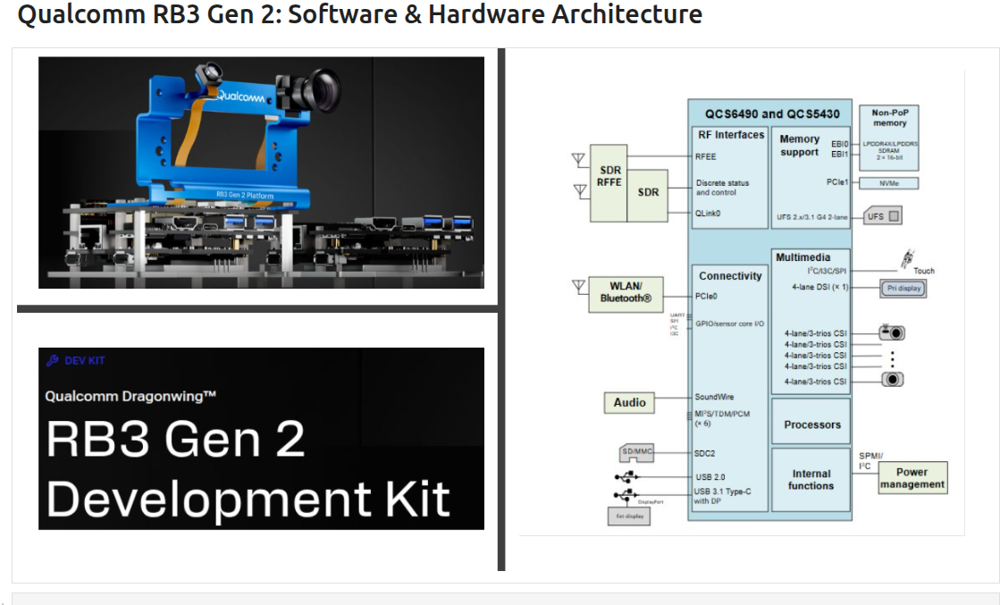

# Embedded AI Benchmarking and Profiling (Qualcomm RB3)

## Qualcomm RB3 Architecture

A hands-on technical course covering **performance benchmarking, profiling, and system-level optimization for Embedded AI systems** on Qualcomm RB3 platforms.

This repository contains practical tutorials and deep dives into the internal architecture of CPU, multimedia pipelines, AI accelerators, and system profiling tools used in edge AI workloads.

---

## Topics Covered

### System Architecture
- Qualcomm RB3 software and hardware architecture

### CPU Performance
- Cache hierarchy internals
- ARM NEON vector processing
- OpenMP parallel performance

### AI Acceleration
- Qualcomm SNPE SDK internals
- Model quantization techniques
- AI inference optimization

### Benchmarking & Profiling
- RB3 benchmarking hands-on
- Performance profiling techniques

### Multimedia Pipelines
- GStreamer internals
- Camera pipeline optimization

### Sensor Processing
- Intel RealSense internals

---

## Learning Goals

After completing this course you will understand:

- How to benchmark embedded AI workloads
- How CPU architecture affects performance
- How AI inference is optimized on edge devices
- How to profile multimedia and sensor pipelines
- How to analyze system bottlenecks in embedded platforms

---

## Target Audience

- Embedded Systems Engineers
- Edge AI Developers
- Robotics Engineers
- Performance Engineers

---

## Platform

Tested on:

Qualcomm RB3 Platform

---

## Author

Atul Vaish  
Performance Engineering | Embedded Systems | AI Systems Optimization
